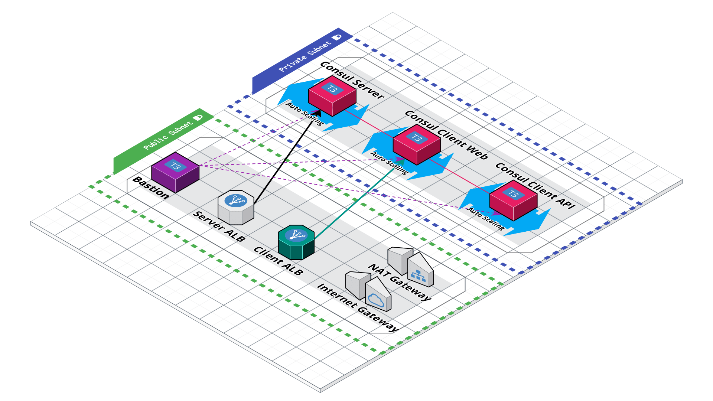

# Getting into Consul

This is the repo used in the [Getting into HashiCorp Consul](https://www.youtube.com/playlist?list=PL81sUbsFNc5b8i2g2sB_tG-PuZxEdlDpK) series where we walk through building out a Consul based architecture and cluster, on AWS, from scratch.

This repo is split into branches, each representing a part in the series:

- [Part 0 - Beginning of the Project](https://github.com/jcolemorrison/getting-into-consul/tree/part-0)
- [Part 1 - Configuring Server and Client on AWS](https://github.com/jcolemorrison/getting-into-consul/tree/part-1)
- [Part 2 - Configuring Service Discovery for Consul on AWS](https://github.com/jcolemorrison/getting-into-consul/tree/part-2)
- [Part 3 - Scaling, Outage Recovery, and Metrics for Consul on AWS](https://github.com/jcolemorrison/getting-into-consul/tree/part-3)
- [Part 4 - Security, Traffice Encryption, and ACLs](https://github.com/jcolemorrison/getting-into-consul/tree/part-4)
- [Part 5 - All About Access Control Lists (ACLs)](https://github.com/jcolemorrison/getting-into-consul/tree/part-5)
- [Part 6a - Configuring Consul with HCP Vault and Auto-Config](https://github.com/jcolemorrison/getting-into-consul/tree/part-6)
- **[Part 6b - Mostly Manual Configuration for Part-7 and beyond (use this)](https://github.com/jcolemorrison/getting-into-consul/tree/part-6-manual)**
- [Master - The most up-to-date version of the repo](https://github.com/jcolemorrison/getting-into-consul)

## The Architecture So Far:



## Getting Started

To set use this repo, take the following steps:

1. Have an AWS Account.

2. Ensure you have the following things installed locally:
	- [The AWS CLI](https://docs.aws.amazon.com/cli/latest/userguide/cli-chap-getting-started.html)
	- [Terraform](https://www.terraform.io/downloads.html)
	- [Consul](https://www.consul.io/downloads)
	- [jq](https://stedolan.github.io/jq/download/)

3. Either use the root user for your account, or create a new IAM user with either [Admin or PowerUser](https://docs.aws.amazon.com/IAM/latest/UserGuide/access_policies_job-functions.html#jf_developer-power-user) permissions.

4. Set up AWS credentials locally either through environment variables, through the AWS CLI, or directly in `~/.aws/credentials` and `~/.aws/config`.  [More information on authenticating with AWS for Terraform](https://registry.terraform.io/providers/hashicorp/aws/latest/docs#authentication).

5. Create an EC2 Keypair, download the key, and add the private key identity to the auth agent.  [More information on creating an EC2 Keypair](https://docs.aws.amazon.com/AWSEC2/latest/UserGuide/ec2-key-pairs.html).

	```sh
	# After downloading the key from AWS, on Mac for example
	chmod 400 ~/Downloads/your_aws_ec2_key.pem
	
	# Optionally move it to another directory
	mv ~/Downloads/your_aws_ec2_key.pem ~/.ssh/

	# Add the key to your auth agent
	ssh-add -k ~/.ssh/your_aws_ec2_key.pem
	```

6. Create a `terraform.tfvars` file and add the name of your key for the `ec2_key_pair_name` variable:

	```
	ec2_key_pair_name = "your_aws_ec2_key"
	```

7. Run `terraform apply`!

8. After the apply is complete, run the post apply script:

	```sh
	# this will output sensitive values needed in a local file 'tokens.txt'
	bash scripts/post-apply.sh
	```

9. SSH into your Bastion and then into your `getting-into-consul-api` nodes...
	1. Add the `client_api_node_id_token` from `tokens.txt` to the `/etc/consul.d/consul.hcl` file in the acl.tokens block.
	2. Add the `client_api_service_token` from `tokens.txt` to the `/etc/consul.d/api.hcl` file in the service.token block.
	3. Restart both `consul` and the `api` service:
		```sh
		sudo systemctl restart consul
		sudo systemctl restart api
		```

10. SSH into your Bastion and then into your `getting-into-consul-web` nodes...
	1. Add the `client_web_node_id_token` from `tokens.txt` to the `/etc/consul.d/consul.hcl` file in the acl.tokens block.
	2. Add the `client_web_service_token` from `tokens.txt` to the `/etc/consul.d/web.hcl` file in the service.token block.
	3. Restart both `consul` and the `web` service:
		```sh
		sudo systemctl restart consul
		sudo systemctl restart web
		```

11. Create the `allow-dns.hcl` policy and attach it to the Node Identity tokens for the `api` and `web` nodes:
	1. Access the consul console by heading to your application load balancer's DNS printed in the terraform outputs as `consul_server`
	2. Go to **Policies** and click **Create**.
	3. For **Name** enter "allow-dns" and paste the contents of `./policies/allow-dns.hcl` into the **Rules** field.
	4. Click **Save**.
	5. Click on **Tokens**.
	6. For each token with the label like `Serivce Identity: ip-*-*-*-*`, click into it.
	7. Click the dropdown under **Policies** and select our `allow-dns` policy we created.
	8. Click **Save**.
	9. Repeat for all other tokens with the label like `Serivce Identity: ip-*-*-*-*`

12. To verify everything is working, check out your Consul UI...
	- All services in the **Services** tab should be green.
	- All nodes in the **Nodes** tab should be green.

13. To verify the web service is up and running, head to the DNS printed in the terraform output as `web_server`
	- It shouldn't have any errors

### Setting Things Up Manually

Although this repo is set up so that you can get everything working via `terraform apply`, if you'd like to take the manual steps for learning, you can reference these documents:

1. [From Part 1 to Part 2 Manual Steps](part-2-manual-steps.md)
2. [From Part 2 to Part 3 Manual Steps](part-2-manual-steps.md)

For example, if you wanted to manually learn Part 1 to Part 2, begin on the [Part 1 Branch](https://github.com/jcolemorrison/getting-into-consul/tree/part-1), and follow the "[From Part 1 to Part 2 Manual Steps](part-2-manual-steps.md)".

### For Part 4

In order to follow along beyond part 4, for now, you'll need to follow the instructions in the [Part 4 Manual Steps](part-4-manual-steps.md) for setting up ACLs.  Automation will be added later for that.

### Notes

- [Cloud Auto-Join](https://www.consul.io/docs/install/cloud-auto-join) is set up for part 1, despite not being in the stream itself.
